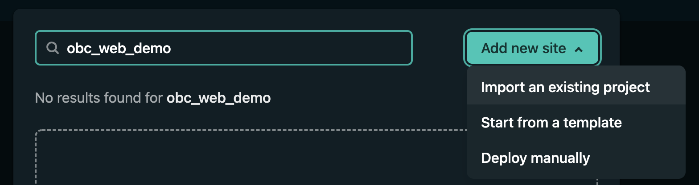
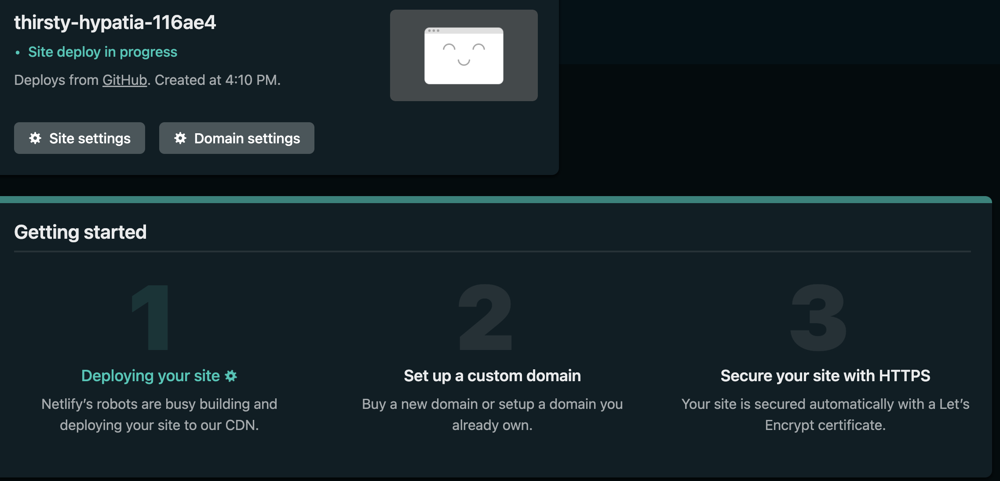

#### Example: Hugo and Netlify
#### Date:
8 March 2022

## Install Hugo to create your website project.
Visit link: https://gohugo.io/getting-started/installing/ to learn how to install the software.

---

## Setup a Hugo website

```
hugo new site newSite
```

Place a `.gitignore` file in the root directory of the repository.

Think up a name for a _public_ repository where you will store your Hugo project at https://github.com/. Please be sure to bookmark this link in your browser for use later.
Note, your code to establish your repository for your Hugo project will take the following form.

```
git init
git add README.md
git commit -m "first commit"
git branch -M main
git remote add origin git@github.com:MYNAME/MY-HUGO-PROJECT.git
git push -u origin main
```

Check with the GitHub.com project website to ensure that your project files were correctly pushed.


Download a theme to place into the `themes/` directory.

To demonstrate how to add a theme for your Hugo project, we will use the `ga-hugo-theme` theme which is provided from Giraffeacademy and discussed in the YouTube video at link: https://www.youtube.com/watch?v=L34JL_3Jkyc. For your project you could use this theme or select another to install from the link: https://themes.gohugo.io/.


```
git clone git@github.com:giraffeacademy/ga-hugo-theme.git themes/ga-hugo-theme
```

Note: with this particular theme's repository, you will have to remove the file `theme/ga-hugo-theme/.git` to avoid complications with Netlify's configuration later. Be sure that you are not removing the `.git` file for your Hugo project!


Edit `config.toml` file to add the below line.

```
theme = "ga-hugo-theme"
```

Run the Hugo server with your project to ensure that the site is working properly. Press Control-C to stop the server.

```
hugo server -D
```

Goto `http://localhost:1313/` on your browser to see your project in action.


If all has gone well, then commit these changes to your project repository.  

```
git add -A
git commit -m "Initial files for website project"
git push
```


Add your first post called `post_8March2022.md` to experiment with adding posts.

```
hugo new post_8March2022.md
```

Be sure to edit draft status at the top of the created Markdown file: `content/post_8March2022.md.` This can be done by changing `draft: true` to `draft: false` which will allow the file's content to be displayed in the project.


If all has gone well, commit these changes to your project repository.  

```
git add -A
git commit -m "Adding first post to project"
git push
```

---

## Netlify
Build your project online.

1. Go to [Netlify's website](https://netlify.com) and sign up or log in. 

2. Go to the "Sites" tab and click on "Add new site" 

3. Select "Import an existing project" 

4. Connect to GitHub by clicking on the "GitHub" button 

5. Choose the repository to link to your site on Netlify. 

6. Verify the settings. 

7. Deploy the site by clicking on the "Deploy site" button.

Note: your link will take the form: https://thirsty-hypatia-116ae4.netlify.app/


8. Once the deployment is complete, go to "Site settings", click on "Change site name", and change the site name to something connected to the likely area of your research.

### References

YouTube:
- Getting started with Hugo
  - https://gohugo.io/getting-started/installing/
- Installing & Using Themes | Hugo - Static Site Generator | Tutorial 5
  - <https://www.youtube.com/watch?v=L34JL_3Jkyc>
- How to create HUGO website & deploy to Netlify
  - <https://www.youtube.com/watch?v=J08HrMroGqM&t=50s>
- Theme:
  - <https://github.com/giraffeacademy/ga-hugo-theme>
- Installing & Using Themes from Giraffeacademy
  - <https://www.youtube.com/watch?v=L34JL_3Jkyc>
